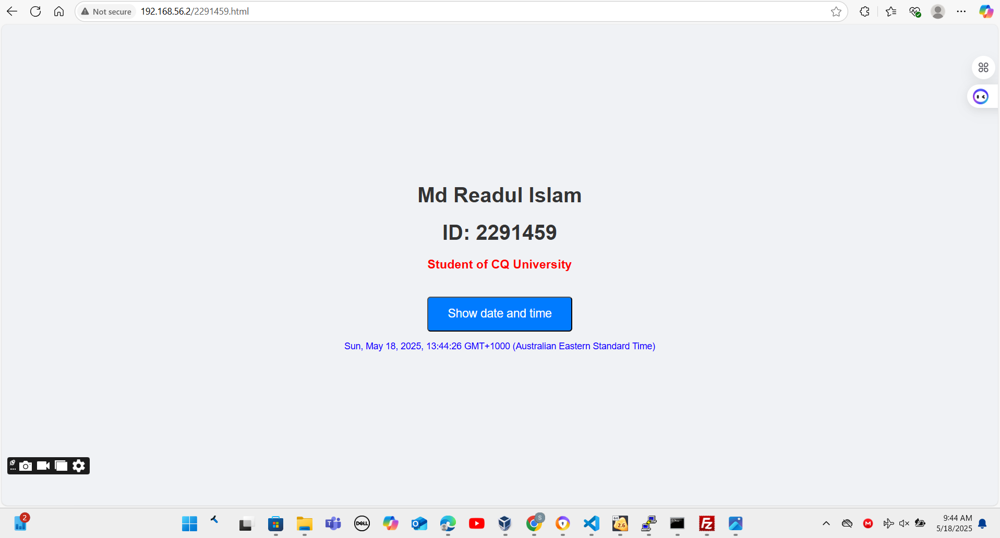

## Task 2

**Create or Modify the Following Files:**
- [index.html](images/index.html)
- [12301422.html](images/12301422.html)
- [styles.css](images/mystyle.css)

I set up a webpage that you can access through any browser at `http://192.168.56.2`. When you first go to the site, it shows the main index page. There’s a button labeled "Show date and time," and when I clicked it, the page updated to display the current date and time right on the screen.

## Task 3

**HTTP Traffic Capture File**: [http-12301422.pcap](images/http-12301422.pcap)

**ARP Table**:

## Task 4

**Apply a filter to capture only HTTP traffic for focused analysis.:**

#### a) Understanding HTTP Request/Response Cycles: Triggers, Requests, and Responses Explained
Here’s what I found when looking at the HTTP traffic in the capture:
- **No. 4: 192.168.56.1 → 192.168.56.2 (HTTP/1.1 & GET, 495 bytes)**  
I opened my browser and typed in the server’s IP to visit the main page. That action sent an HTTP GET request to the root (`/`). There’s no response in this capture, but I think it came in a later packet.
- **No. 8: 192.168.56.2 → 192.168.56.1 (HTTP/1.1 200 OK, 692 bytes)**  
This is the server replying to my GET request from packet No. 4. Since I asked for the root page (`/`), the server sent back a 200 OK status with the HTML content for that page.
- **No. 9: 192.168.56.1 → 192.168.56.2 (GET /mystyle.css HTTP/1.1, 390 bytes)**  
After loading the main page, my browser noticed a CSS file referenced in the HTML, so it sent a GET request for `/mystyle.css`. The response isn’t shown here, but it probably came later.
- **No. 13: 192.168.56.2 → 192.168.56.1 (HTTP/1.1 200 OK, 225 bytes)**  
This is the server replying to my request for `/mystyle.css` from packet No. 9. It sent a 200 OK status and delivered the CSS file, which my browser used to style the page.
- **No. 15: 192.168.56.1 → 192.168.56.2 (GET /12301422.html HTTP/1.1, 539 bytes)**  
I clicked a link on the main page that took me to `12301422.html`, so my browser sent a GET request for that page. The response isn’t in this capture, but I’m guessing it’s in a later packet.
- **No. 19: 192.168.56.2 → 192.168.56.1 (HTTP/1.1 200 OK, 644 bytes)**  
This is the server’s reply to my request for `12301422.html` from packet No. 15. It sent a 200 OK status and the HTML content for that page.
- **No. 20: 192.168.56.1 → 192.168.56.2 (GET /mystyle.css HTTP/1.1, 488 bytes)**  
When the browser loaded `12301422.html`, it saw that the same CSS file (`mystyle.css`) was needed again, so it sent another GET request for it. The response isn’t shown here.
- **No. 23: 192.168.56.2 → 192.168.56.1 (HTTP/1.1 304 Not Modified, 189 bytes)**  
This is the server’s reply to the request for `/mystyle.css` in packet No. 20. Since the browser already had the CSS file from earlier, the server sent a 304 Not Modified status, meaning the browser could just use the cached version.

#### b) First HTTP Request/Response: Identifying the Following
For the first HTTP request, which is packet No. 4 (GET / HTTP/1.1), here’s what I found:  
1. Source IP Address: 192.168.56.1  
2. Destination IP Address: 192.168.56.2  
3. Source Port: 62219  
4. Destination Port: 80  
5. Transport Protocol: TCP (since HTTP uses TCP, which I can tell from the packet capture).

#### c) Did the browser request the server for the date and time when the button was clicked?  
No, the browser didn’t send a request to the server when I clicked the "Show date and time" button. I think this is because the date and time are handled by JavaScript on the browser side using something like the `Date()` function. The browser can get the system time directly, so it doesn’t need to ask the server. I didn’t see any HTTP requests in the capture that looked like they were related to the button click.

#### d) Packet Diagram for HTTP Request/Response of Newly Created Web Page (12301422.html)  
The HTTP request for `12301422.html` is packet No. 15 (Time: 9.659994, GET /12301422.html HTTP/1.1, Length: 539 bytes).  

**Origin of Diagram File**: [packet_diagram.drawio](images/week6-task4-packet_diagram.drawio)

**Breakdown of Sizes:**  
- Ethernet Header: 14 bytes  
- IPv4 Header: 20 bytes  
- TCP Header: 20 bytes  
- HTTP Request: 485 bytes (since the total packet is 539 bytes, I subtracted the headers: 539 - 14 - 20 - 20 = 485).  
- **Total Packet Size:** 539 bytes.  

**Addresses:**  
- Ethernet Header: 0a:00:27:00:00:0a (Source MAC), 08:00:27:05:2b:d9 (Destination MAC)  
- IPv4 Header: 192.168.56.1 (Source IP), 192.168.56.2 (Destination IP)  
- TCP Header: Source Port (62219), Destination Port (80).  
- HTTP Request: The Host header probably has 192.168.56.2, since that’s the server’s IP.

#### e) Analyzing the HTTP Referrer for the Request in Part (d): Referrer Value, Identification, and Web Server Usage  
For packet No. 15 (GET /12301422.html), the referrer is the page I came from. Since I clicked a link on the homepage to get to `12301422.html`, the referrer is `http://192.168.56.2/`. This shows I was on the main page before going to the new page. The web server can use this to track how I’m navigating the site, like seeing which pages lead to others. It’s also useful for analytics, like figuring out where traffic is coming from, or for security, like checking if someone’s linking to the site in a weird way. The server might even change what it shows based on the referrer, like adding related links.

#### f) HTTP Request from Part (d): Browser Information (Name, Version) Revealed to the Server  
In packet No. 15 (GET /12301422.html), the HTTP request probably has a User-Agent header that tells the server about my browser. It shows I’m using Chrome, version 137.0.7151.40, on Windows 11 (Windows NT 11.0), with a 64-bit architecture (Win64; x64), and the WebKit rendering engine (AppleWebKit/537.36). The server can use this to make sure the page works well on my browser or to keep track of what browsers people are using.

#### g) Use of HTTP Version and Transport Protocol  
The HTTP version used here is HTTP/1.1, which I can see in packets like 9, 13, and 19 where it says "HTTP/1.1". The transport protocol is TCP, since all the packets show TCP being used.

#### h) TCP Connection Setup: Packet Analysis and Timing  
The TCP connection setup involves these packets:  
- Packet 1: SYN (Seq=0 Win=65535 Len=0).  
- Packet 2: SYN-ACK (Seq=0 Ack=1 Win=64280 Len=0).  
- Packet 3: ACK (Seq=1 Ack=1 Win=65280 Len=0).  

To find the time between the start of the connection and the first data transfer:  
- Start: Packet 1 at 0.000047 seconds.  
- Data Transfer: Packet 5 (HTTP GET) at 0.008091 seconds.  
- Time: About 0.008044 seconds (or 8.044 ms).

#### i) Recognize the Acknowledgements:  
Here are the acknowledgment packets I found:  
- Packet 3: ACK (Seq=1 Ack=1 Win=65280 Len=0).  
- Packet 6: ACK (Seq=1 Ack=442 Win=64880 Len=4).  
- Packet 8: ACK (Seq=442 Ack=1 Win=65280 Len=0).  
- Packet 10: ACK (Seq=778 Ack=1 Win=64880 Len=41).  
- Packet 12: ACK (Seq=778 Ack=181 Win=65280 Len=0).  
- Packet 14: ACK (Seq=2352 Ack=1 Win=65280 Len=0).  
- Packet 18: ACK (Seq=1263 Ack=3853 Win=65280 Len=0).  
- Packet 24: ACK (Seq=1697 Ack=4629 Win=64512 Len=0).  

These ACKs are usually sent right after the browser or server receives a packet, like a SYN-ACK or some data. Sometimes TCP waits a bit (maybe 200 ms) or sends an ACK after getting two segments, depending on how it’s set up.

## Task 5

**Explanation of Type of Information Found in Cookies:** From a web browser, cookies are used to store various types of information, including session management, tracking, authentication, and user preferences. The types of information stored include:

1. **Session Identifiers:** I noticed cookies like `Secure-1PSID`, `Secure-3PSID`, or `cfuvid` that seem to hold session IDs to keep track of me as I move around a site or come back later.
2. **Authentication Tokens:** Cookies such as `Secure-1PSIDCC`, `Secure-3PSIDCC`, and `_Secure-ENID` look like they store login details to make sure it’s really me accessing my account.
3. **Tracking & Analytics:** I saw cookies like `_ga`, `_ga_1VC9IXRYWRC`, and `_fbp` that track what I do—`_ga` is from Google Analytics to see my page visits, and `_fbp` is for Facebook ads.
4. **User Preferences and Settings:** Cookies like `dds` and `_rb` might save things like how I want the site to look, maybe stuff like display options I picked.
5. **Advertising Identifiers:** Cookies such as `_eoi` and `_rb` (e.g., `_eoi` has `ID=497e8c833905...`) seem to store user IDs for showing me ads that fit my interests.
6. **Security and Anti-Fraud:** I found cookies like `Secure-1PSIDTS` and `Secure-3PSIDTS` (e.g., `sidts=CjIBl...` for `Secure-1PSIDTS`) that add timestamps to keep things secure, like stopping replay attacks.
7. **Content Delivery and Performance:** Cookies like `cf_bm` and `cfuvid` (e.g., `NuN45Hdr6RVHC...` for `cf_bm`) are from Cloudflare to handle bots and make the site load faster.
8. **Cross-Site Behavior:** The `SameSite` flag, like "None" or "Lax," decides how cookies work with other sites—"None" lets them go with third-party stuff, while "Lax" or "Strict" is safer.
9. **Expiration and Persistence:** The `Expires` column shows how long cookies last—some, like `cfuvid`, go away when I close the browser, while others stick around for a long time.
10. **Priority and Size:** The `Priority` column ("Medium," "High") tells me how important a cookie is—like "High" for login cookies—and the `Size` column (e.g., 177, 82) shows how much data each one holds.

**Summary:** These cookies handle tracking my session, keeping my login secure, watching how I use the site, saving my settings, showing me ads, securing the connection, and making the site load faster, mostly for services like Google, Cloudflare, and ad platforms.
