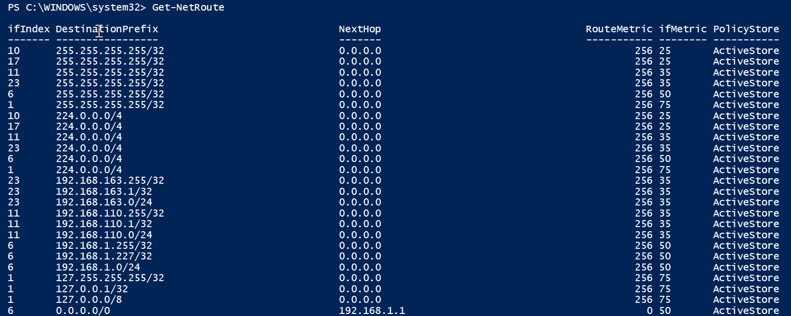
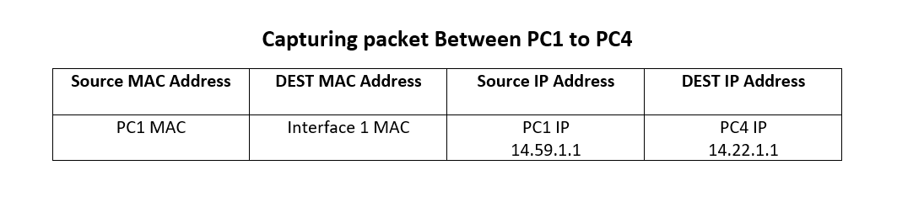
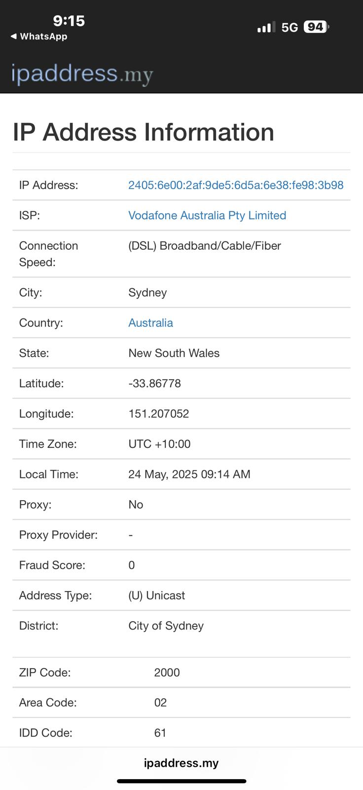

# COIT20246 Week 05 Tutorial Journal

## Task 2: View Routing Table
**Captured image(s) of the routing table:**


**Summary of Five Entries**:
1. **Destination: 0.0.0.0/0, Gateway: 192.168.1.1, Interface: 192.168.1.100, Metric: 25**
   - This is the default route. Packets to any IP not matching other routes are sent to the gateway (`192.168.1.1`, my router) via my Wi-Fi interface. The low metric indicates this is the preferred route for non-local traffic.
2. **Destination: 192.168.1.0/24, Gateway: 0.0.0.0, Interface: 192.168.1.100, Metric: 281**
   - This is my local LAN. Packets to `192.168.1.0–192.168.1.255` are sent directly via my interface (no gateway needed), as indicated by the 0.0.0.0 gateway.
3. **Destination: 192.168.1.100/32, Gateway: 0.0.0.0, Interface: 192.168.1.100, Metric: 281**
   - This is my own IP address (loopback for my device). Packets to myself are handled locally, ensuring internal communication works without leaving the device.
4. **Destination: 192.168.1.255/32, Gateway: 0.0.0.0, Interface: 192.168.1.100, Metric: 281**
   - This is the broadcast address for my LAN. Broadcast packets are sent directly to all devices on `192.168.1.0/24`, facilitating network discovery and communication.
5. **Destination: 224.0.0.0/4, Gateway: 0.0.0.0, Interface: 192.168.1.100, Metric: 281**
   - This is for multicast traffic. Multicast packets (e.g., for streaming or group communications) are sent directly via my interface, supporting protocols like IGMP.
## Task 3: IP Network Design

**List of Devices and Their Addresses**:

| Device        | Interface         | IP Address      |
|---------------|-------------------|-----------------|
| PC1           | eth0              | 14.59.1.1/24    |
| PC2           | eth0              | 14.59.1.2/24    |
| PC3           | eth0              | 14.59.1.3/24    |
| Switch 1      | -                 | No IP           |
| Router 1      | LAN interface     | 14.59.1.254/24  |
| Router 1      | WAN interface     | 10.0.0.1/24     |
| Router 2      | WAN interface     | 10.0.0.2/24     |
| Router 2      | LAN interface     | 14.22.1.254/24  |
| Switch 2      | -                 | No IP           |
| PC4           | eth0              | 14.22.1.1/24    |
| PC5           | eth0              | 14.22.1.2/24    |

**Network Diagram**:


- **Source File**: [network.drawio](images/week05-task3-network.drawio)


**Routing Tables**:
- **Router 1**:
  ```
  Destination      Gateway         Interface
  14.59.1.0/24     -               14.59.1.254
  14.22.1.0/24     10.0.0.2        10.0.0.1
  ```
- **Router 2**:
  ```
  Destination      Gateway         Interface
  14.22.1.0/24     -               14.22.1.254
  14.59.1.0/24     10.0.0.1        10.0.0.2
  ```
- **PC1**:
  ```
  Destination      Gateway         Interface
  14.59.1.0/24     -               14.59.1.1
  0.0.0.0/0        14.59.1.254     14.59.1.1
  ```
- **PC2**:
  ```
  Destination      Gateway         Interface
  14.59.1.0/24     -               14.59.1.2
  0.0.0.0/0        14.59.1.254     14.59.1.2
  ```
- **PC3**:
  ```
  Destination      Gateway         Interface
  14.59.1.0/24     -               14.59.1.3
  0.0.0.0/0        14.59.1.254     14.59.1.3
  ```
- **PC4**:
  ```
  Destination      Gateway         Interface
  14.22.1.0/24     -               14.22.1.1
  0.0.0.0/0        14.22.1.254     14.22.1.1
  ```
- **PC5**:
  ```
  Destination      Gateway         Interface
  14.22.1.0/24     -               14.22.1.2
  0.0.0.0/0        14.22.1.254     14.22.1.2
  ```
- **Notes**: PCs use their router’s LAN interface as the default gateway for non-local traffic. The test network is isolated, so no external default routes are needed beyond the LAN.

**Packet Diagram**: Captured ICMP Packet.



## Task 4: Academic Integrity Outcomes

**Summary of Most Interesting Scenario**:
The most discussed scenario involved a student submitting a group project report that was copied verbatim from an online tutorial website without citation. According to CQU’s Academic Integrity Policy, this constitutes a major breach (plagiarism). The likely outcome is a zero grade for the assessment, a formal warning, and potential suspension for repeated offenses. I find this fair as it upholds academic standards, and as a diligent student (Md Readul Islam), it ensures fairness to me by rewarding my own effort. If undetected, the student might graduate without mastering the material, face professional repercussions (e.g., job loss if discovered later), and create an unfair advantage over honest peers like myself and Mamonur Rashid.

**Recommendations to Other Students**:
1. Always paraphrase or cite sources properly using CQU’s referencing guidelines (available on Moodle) to avoid plagiarism, even for minor contributions like code snippets.
2. Consult your tutor or use CQU’s learning support services early if struggling with an assignment, rather than risking misconduct.

## Task 5: IP Address Lookup

**Results and Explanations**: On my home network, using the ipaddress.my website on May 24, 2025, at 09:14 AM UTC+10:00 (equivalent to 07:14 AM +06), the lookup identified my public IP as 2405:6e00:2af:9de5:6d5a:6e38:fe98:3b98, provided by Vodafone Australia Pty Limited with a DSL/Broadband/Cable/Fiber connection, locating me in Sydney, New South Wales, Australia, with coordinates -33.8678 latitude and 151.207052 longitude, and a ZIP code of 2000. This accuracy is impressive, pinpointing my city and state, though it doesn’t specify my exact address, likely due to the ISP’s geolocation data, and it reflects the public IP rather than my device’s private IP.



