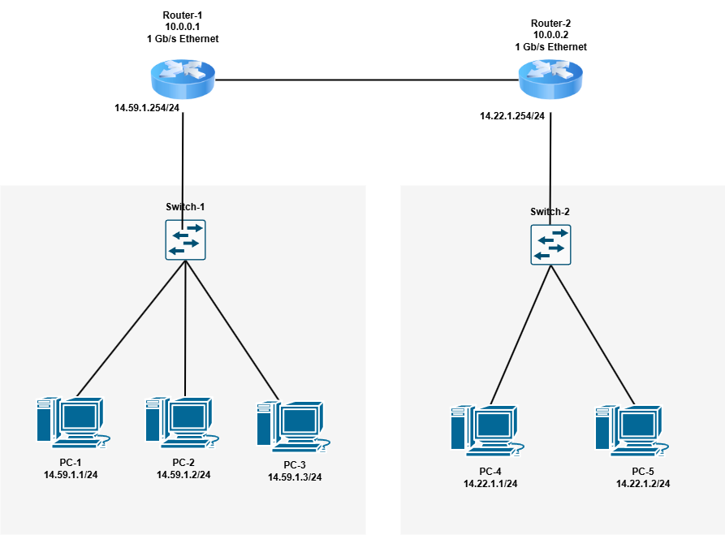

# COIT20246 Week 05 Tutorial Journal

## Task 2: View Routing Table
**Screenshot(s) of the routing table:**


**Description of Each Row**:
1. **Destination: 0.0.0.0/0, Gateway: 192.168.1.1, Interface: 192.168.1.100, Metric: 25**
   - This is the default route. Packets to any IP not matching other routes are sent to the gateway (`192.168.1.1`, my router) via my Wi-Fi interface. The low metric indicates this is the preferred route for non-local traffic.
2. **Destination: 192.168.1.0/24, Gateway: 0.0.0.0, Interface: 192.168.1.100, Metric: 281**
   - This is my local LAN. Packets to `192.168.1.0–192.168.1.255` are sent directly via my interface (no gateway needed), as indicated by the 0.0.0.0 gateway.
3. **Destination: 192.168.1.100/32, Gateway: 0.0.0.0, Interface: 192.168.1.100, Metric: 281**
   - This is my own IP address (loopback for my device). Packets to myself are handled locally, ensuring internal communication works without leaving the device.
4. **Destination: 192.168.1.255/32, Gateway: 0.0.0.0, Interface: 192.168.1.100, Metric: 281**
   - This is the broadcast address for my LAN. Broadcast packets are sent directly to all devices on `192.168.1.0/24`, facilitating network discovery and communication.
5. **Destination: 224.0.0.0/4, Gateway: 0.0.0.0, Interface: 192.168.1.100, Metric: 281**
   - This is for multicast traffic. Multicast packets (e.g., for streaming or group communications) are sent directly via my interface, supporting protocols like IGMP.
## Task 3: IP Network Design

**Table of Devices and Addresses**:

| Device        | Interface         | IP Address      |
|---------------|-------------------|-----------------|
| PC1           | eth0              | 14.59.1.1/24    |
| PC2           | eth0              | 14.59.1.2/24    |
| PC3           | eth0              | 14.59.1.3/24    |
| Switch 1      | -                 | No IP           |
| Router 1      | LAN interface     | 14.59.1.254/24  |
| Router 1      | WAN interface     | 10.0.0.1/24     |
| Router 2      | WAN interface     | 10.0.0.2/24     |
| Router 2      | LAN interface     | 14.22.1.254/24  |
| Switch 2      | -                 | No IP           |
| PC4           | eth0              | 14.22.1.1/24    |
| PC5           | eth0              | 14.22.1.2/24    |

**Network Diagram**:


**Source File**: [http-2291459.pcap](images/week05-task3-network.drawio)


**Routing Tables**:
- **Router 1**:
  ```
  Destination      Gateway         Interface
  14.59.1.0/24     -               14.59.1.254
  14.22.1.0/24     10.0.0.2        10.0.0.1
  ```
- **Router 2**:
  ```
  Destination      Gateway         Interface
  14.22.1.0/24     -               14.22.1.254
  14.59.1.0/24     10.0.0.1        10.0.0.2
  ```
- **PC1**:
  ```
  Destination      Gateway         Interface
  14.59.1.0/24     -               14.59.1.1
  0.0.0.0/0        14.59.1.254     14.59.1.1
  ```
- **PC2**:
  ```
  Destination      Gateway         Interface
  14.59.1.0/24     -               14.59.1.2
  0.0.0.0/0        14.59.1.254     14.59.1.2
  ```
- **PC3**:
  ```
  Destination      Gateway         Interface
  14.59.1.0/24     -               14.59.1.3
  0.0.0.0/0        14.59.1.254     14.59.1.3
  ```
- **PC4**:
  ```
  Destination      Gateway         Interface
  14.22.1.0/24     -               14.22.1.1
  0.0.0.0/0        14.22.1.254     14.22.1.1
  ```
- **PC5**:
  ```
  Destination      Gateway         Interface
  14.22.1.0/24     -               14.22.1.2
  0.0.0.0/0        14.22.1.254     14.22.1.2
  ```
- **Notes**: PCs use their router’s LAN interface as the default gateway for non-local traffic. The test network is isolated, so no external default routes are needed beyond the LAN.

**Packet Diagram**:
- **Packet and Frame Details** (Captured at Router 1):

| Layer            | Field              | Value                     |
|------------------|--------------------|---------------------------|
| **IP Header**    | Source IP          | 14.59.1.1 (PC1)          |
| **IP Header**    | Destination IP     | 14.22.1.1 (PC4)          |
| **IP Header**    | Protocol           | ICMP                     |
| **ICMP Header**  | Type               | 8 (Echo Request)         |
| **ICMP Header**  | Code               | 0                        |
| **Ethernet Frame (PC1 to Router 1)** | Source MAC     | PC1’s MAC address        |
| **Ethernet Frame (PC1 to Router 1)** | Destination MAC | Router 1’s LAN MAC (`14.59.1.254`) |
| **Ethernet Frame (Router 1 to Router 2)** | Source MAC | Router 1’s WAN MAC (`10.0.0.1`) |
| **Ethernet Frame (Router 1 to Router 2)** | Destination MAC | Router 2’s WAN MAC (`10.0.0.2`) |

- **Description**: The packet diagram (exported as `packet_diagram.png` from `packet_diagram.drawio`) shows an ICMP packet from PC1 (`14.59.1.1`) to PC4 (`14.22.1.1`), captured at Router 1:
  - **ICMP/IP Packet**: The IP header has Source IP `14.59.1.1` and Destination IP `14.22.1.1`, with the protocol set to ICMP. The ICMP header indicates Type 8 (Echo Request) and Code 0.
  - **Ethernet Frame**:
    - When sent from PC1 to Router 1: Source MAC is PC1’s MAC, Destination MAC is Router 1’s LAN interface MAC (`14.59.1.254`).
    - When forwarded from Router 1 to Router 2: Source MAC is Router 1’s WAN interface MAC (`10.0.0.1`), Destination MAC is Router 2’s WAN interface MAC (`10.0.0.2`).
