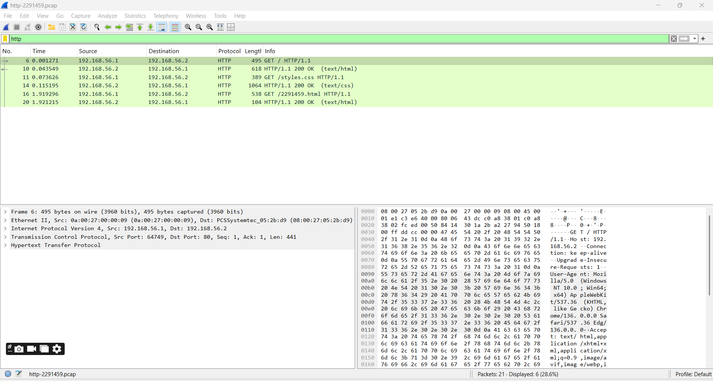

## Task 2
Files to Create/Edit:
- [index.html](images/index.html)
- [12291459.html](images/12291459.html)
- [styles.css](images/styles.css)

Using `http://192.168.56.2`, we can access the webpage via any web browser. Initially, it opens the index page. Upon clicking the "Show date and time" button, the date and time are displayed as shown below:

## Task 3

**HTTP Packet Capture File**: [http-2291459.pcap](images/http-2291459.pcap)

**ARP Table**:

## Task 4

Filter for HTTP packets only to focus on HTTP traffic:

#### a) Understanding HTTP Request/Response Methods: Motivations, Requests, and Responses

The image shows the following HTTP requests. Here’s the analysis for each:

1. **Time: 0.001271, GET / (HTTP/1.1 200 OK, 495 bytes)**
   - The user most likely entered the server's IP (`192.168.56.2`) or hostname in the browser and requested the root of the server.
   - Browser initiated an HTTP GET to the root resource.
   - The server response was `200`, the request was delivered, and the server responded with data that the client wanted, which in this case is a 495-byte HTML file (`text/html`) - likely the homepage.
2. **Time: 0.043549, GET / (HTTP/1.1 200 OK, 618 bytes, text/html)**
   - This looks like a subsequent request, which could be due to the browser doing a page refresh or navigating to the same root page again.
   - Another GET on the root (`/`).
   - The server returned HTTP status code: `200`. The response contained an HTML page of size 618 bytes (`text/html`). The size difference of both (618 vs 495 bytes) could be one of an altered page, or maybe it was a different root resource.
3. **Time: 0.073626, GET /styles.css (HTTP/1.1 200 OK, 389 bytes)**
   - The browser received and began to parse the root page's HTML, and it found a link to a CSS file (`styles.css`) for styling the page.
   - HTTP GET for file `/styles.css`.
   - The server returned the site with a `200 OK` status, delivering a 389-byte CSS file (`text/css`).
4. **Time: 0.115195, GET / (HTTP/1.1 200 OK, 1064 bytes, text/css)**
   - This is unusual because the request is for `/` but the response is a CSS file. It's likely a misconfiguration on the server or an error in the capture. Normally, this would be triggered by the user accessing the root page again.
   - The root resource (`/`) requested by an HTTP GET.
   - The server returned the site with a `200 OK` status, but delivered a 1064-byte CSS file (`text/css`), which doesn't match the expected HTML content.
5. **Time: 1.919296, GET /2291459.html (HTTP/1.1 200 OK, 538 bytes)**
   - User probably followed to a particular page, clicking on a link on the home page, or entered the URL manually.
   - HTTP GET requests for the file `/2291459.html`.
   - The server returned the `200 OK` status, delivering a 538-byte HTML file (`text/html`), which is likely the user's newly created web page.
6. **Time: 1.921215, GET / (HTTP/1.1 200 OK, 104 bytes, text/html)**
   - This can be caused either by the browser automatically refreshing the root page, or by the user navigating back to the homepage.
   - HTTP GET request for the root resource (`/`).
   - Server returned the `200 OK` status, delivering a 104-byte HTML file (`text/html`), which is much smaller than previous root responses (possibly cached or a smaller version).

#### b) First HTTP Request Details
The first HTTP request is at **Time 0.001271 (Frame 6)**. The 5 address values are:

1. **Source IP Address (Host):** `192.168.56.1` (client).
2. **Destination IP Address (Host):** `192.168.56.2` (server).
3. **Source Port (Transport Protocol):** `64749`.
4. **Destination Port (Transport Protocol):** `80` (standard HTTP port).
5. **Application Protocol:** HTTP (Hypertext Transfer Protocol, as indicated by the `GET / HTTP/1.1` request).

#### c) Browser Behavior: Web Server Request on Clicking "Time & Date" Button
No, when we pressed the button, our web browser probably didn't send any requests to the web server.

**Reason:** It's client-side handling of things, to put up the time and date of rendering on screen + use the computer's time [which is done a lot of times with client-side scripting (in JavaScript, as used to get the local time on the browser from your system, with `Date()` function). No browser will do a new HTTP request to the web server to perform this & write it to the client because it can ask the user's device for the current date/time. There aren't any more HTTP requests in the packet capture that would be indicative of such an action, and that's not looking like any server request was made.

#### d) Diagram of `/2291459.html` HTTP Request

**HTTP request:** `GET /2291459.html HTTP/1.1`. Let's break down the packet structure, including header sizes and addresses.

**Packet Diagram file**: [packet_diagram.drawio](images/week6-task4-packet_diagram.drawio)

**Size Breakdown:**

- **Ethernet Header:** 14 bytes
- **IPv4 Header:** 20 bytes
- **TCP Header:** 20 bytes
- **HTTP Request:** 484 bytes (as per the packet details: Len: 484 bytes).
- **Total Packet Size:** 14 + 20 + 20 + 484 = 538 bytes.

**Addresses Included:**

- **Ethernet Layer:** MAC (Source) (`0a:00:27:00:00:09`), and MAC (Destination) (`08:00:27:05:2b:d9`).
- **IP Layer:** IP (Source) (`192.168.56.1`), IP (Destination) (`192.168.56.2`).
- **TCP Layer:** Port (Source) (`64749`), Port (Destination) (`80`).
- **HTTP Layer:** Host header contains the destination host (`192.168.56.2`).

#### e) Referrer for `/2291459.html` HTTP Request

**Referrer**: The HTTP request for `/2291459.html` includes a `Referer` header: `http://192.168.56.2/`.

**Identifies**: The `Referer` header indicates the source page of the request. Here, it shows the user was on the homepage (`http://192.168.56.2/`) and either clicked a link or entered `/2291459.html` manually.

**How Web Servers Use This Data**:

- **Analytics**: Tracks where users are coming from (e.g., which page led to the current request).
- **Security**: Helps detect suspicious activity, like cross-site request forgery (CSRF), by verifying the request’s origin.
- **User Experience**: Can modify responses based on the referrer (e.g., adding a “back to home” link).

#### f) Server-Learned Data About the Web Browser

Headers The `HTTP-request` includes the `User-Agent` header, which discloses the browser of the user. The User-Agent string itself doesn’t appear in the capture, but if you look at the details of the HTTP packet at the right of the screenshot, you can see part of the HTTP request:

**User-Agent**: `Mozilla/5.0 (Windows NT 10.0; Win64; x64) AppleWebKit/537.36 (KHTML, like Gecko) Chrome/126.0.0.0 Safari/537.36 Edge/126.0.0.0`

**Information Learned**:

- **Browser Name**: Microsoft Edge (`Edge/126`)
- **Browser Version**: `126.0.0.0`
- **Rendering Engine**: WebKit/Blink (`AppleWebKit/537. skis36`)
- **OS**: Windows 10 (`Windows NT 10.0`)
- **Architecture**: 64-bit (`Win64; x64`)
- **Compatibility**: `Mozilla/5.0` and `Safari/537.36` are for historical web compatibility

**Server Uses**:

- Optimize content delivery (e.g., browser-specific CSS/JavaScript).
- Track browser usage for analytics.
- Identify compatibility issues with specific browser versions.

#### g) HTTP Version and Transport Protocol

- **HTTP Version**: `HTTP/1.1`
- **Transport Protocol**: `TCP`

#### h) Packets Involved in TCP Connection Setup (3-Way Handshake)

- **Packet 1 (SYN)**: `192.168.56.1 → 192.168.56.2` (start of handshake)
- **Packet 4 (SYN-ACK)**: `192.168.56.2 → 192.168.56.1` (server response)
- **Packet 5 (ACK)**: `192.168.56.1 → 192.168.56.2` (completes handshake)

**Note**: Packets 2 and 3 are ARP packets, unrelated to the TCP handshake.

**Time Calculation**:

- First HTTP request (data transfer): Packet 6 at `0.001271` seconds
- Connection setup starts: Packet 1 at `0.000000` seconds
- **Total Time**: `0.001271` seconds (≈1.27 milliseconds)

**Connection Establishment Packets**: 1, 4, 5

**Time from Connection to Data Transfer**: 1.271 ms

#### i) TCP Acknowledgments (ACKs)

In the TCP protocol, ACK (acknowledgements) is sent to acknowledge receipt of data. From the packet capture:

- **Packet 5**: `[ACK] Seq=1 Ack=1 Win=65280 Len=0` – This is parts of the TCP handshakes, acknowledging the SYN-ACK.
- **Packet 7**: `[ACK] Seq=1 Ack=442 Win=64808 Len=0` – Acknowledges data from the server.
- **Packet 9**: `[ACK] Seq=442 Ack=42 Win=65280 Len=4` – Acknowledges receipt of an HTTP response..
- **Packet 11**: `[ACK] Seq=686 Ack=777 Win=64768 Len=0` – Acknowledges more data.
- **Packet 13**: `[ACK] Seq=777 Ack=647 Win=64768 Len=0` – Another acknowledgment.
- **Packet 15**: `[ACK] Seq=777 Ack=1657 Win=65280 Len=0` – Acknowledges further data.
- **Packet 17**: `[ACK] Seq=1657 Ack=1261 Win=64080 Len=0` – Acknowledges additional data.
- **Packet 19**: `[ACK] Seq=1261 Ack=3158 Win=65280 Len=0` – Acknowledges more data.
- **Packet 21**: `[ACK] Seq=3158 Ack=3208 Win=65280 Len=0` – Final acknowledgment in this capture.

**The usual acknowledgment in TCP is:**:

- **On receiving a segment**: TCP ACKs segments that are received correctly. For instance, after the client has issued an HTTP GET request (Packet 10) the server responds with data (Packet 12), followed by an ACK (Packet 13) from the client, acknowledging the received data.
- **During the TCP Handshake**: As seen in Packet 5, an ACK is sent to complete the three-way handshake.
- **After a certain amount of data**: TCP can be using delayed ACKs, meaning an ACK is sent after a predefined amount of data comes in (e.g., two segments) or a timeout (usually 200 ms) occurs to minimize overhead.
- **To acknowledge out-of-order packets or retransmissions:**: If packets are received out of order, TCP uses selective ACKs (SACK) to acknowledge specific segments, as seen in the `SACK_PERM` option in the packets..

## Task 5

The following Screenshot of the cookies set by BBC website (bbc. com) in the Storage section of the browser's Application tab.

Cookie are a tiny piece of information websites store on a users computer to keep track of activity, such as remembering preferences or managing sessions. Here is a guide to the kinds of information generally found in cookies like those listed; these are cookies measuring just 30 days of activity.

1. **Session and Authentication Data**:
   - Cookies like `ckns_explicit` or `ckns_policy` store user consent for cookie usage or privacy policies.
   - `sp_su` (highlighted) may indicate a user ID or session token for maintaining logged-in states or tracking sessions.

2. **Tracking and Analytics**:
   - Cookies like `atid`, `atuserid`, or `atuserid` are typically used for tracking user behavior across the site. These might store unique identifiers to monitor how users interact with the website, often for analytics purposes (e.g., which pages are visited).
   - `chartbeat2` and `chartbeat4` is related to Chartbeat, a real time analytics service. Cookies for monitoring engagement and interaction with specific elements on the page.

3. **Personalization**:
   - Cookies like `pid`, `pctx`, or `pcus` might store user preferences or personalized settings, such as location, language, or content recommendations. For example, `pid` could be a personalization ID to tailor news content based on user interests. 

4. **Advertising**:
   - Cookies such as `ad_id` or those with long alphanumeric values (e.g., J62H5...) are often tied to advertising networks. They store data to deliver targeted ads, track ad impressions, or measure ad performance.
   - `gads` likely relates to Google Ads, storing information for ad targeting or conversion tracking.

5. **Security and Functionality**:
   - **Secure Flag**: The Secure flag (appearing on some cookies), which tells the browser to send the cookie over HTTPS, to make it more secure.
   - **HttpOnly**: Http Only (present as well) prevents client side scripts from reading the cookie, reducing XSS risk. 
   - **SameSite Settings** (e.g., `Lax` or `None`): SameSite settings (for example, Lax or None) determine how cookies are sent in cross-site requests, which prevents cross-site request forgery (CSRF) attacks.

6. **Expiration and Persistence**:
   -The Expires / Max-Age column shows when cookies expire. For example, most cookies here expire between 2025-05-18 and 2026-11-14, meaning they persist for tracking or functionality over that period.
   - Some cookies, like `ar_debug`, have a shorter lifespan (e.g., 2025-06-17), possibly for temporary debugging purposes.

7. **Size and Priority**:
   - The Size column indicates the cookie's data size in bytes (e.g., 177 bytes for `cf_bm`). Smaller cookies are typically for simple flags, while larger ones might store more complex data like encoded user profiles.
   - Priority (e.g., `Medium`, `Lax`) reflects the cookie's importance for browser handling, though this is less about the data type and more about browser behavior.

**Summary**: These cookies contain a mix of session management, user tracking, personalization, advertising, and security-related data. They help the website function smoothly, improve user experience, and provide analytics or targeted ads, while also implementing security measures to protect user data.
