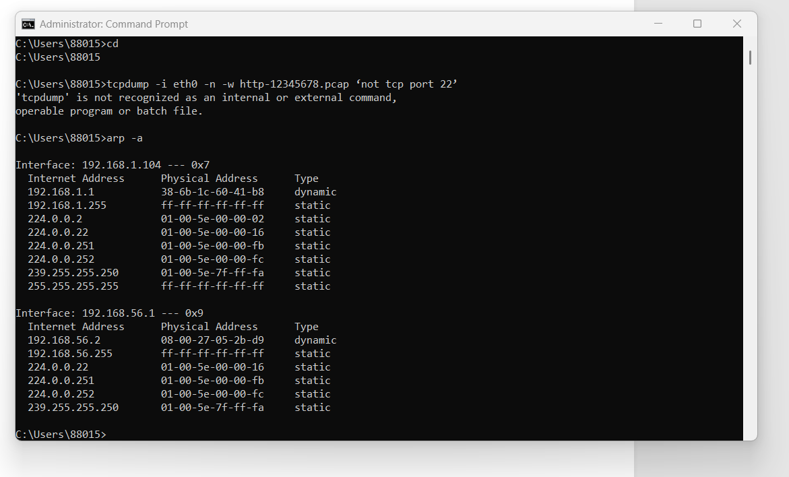

## Task 2

Using http://192.168.56.2 , we can run the webpage using any web browser. Initially, it will open index page. Upon clicking on button “Show date and time” we are getting the times and 
date which is depicts below:

## Task 3
**HTTP packet capture file**: [http-2291459.pcap](image/http-2291459.pcap). 

**ARP Table is shown below:**

