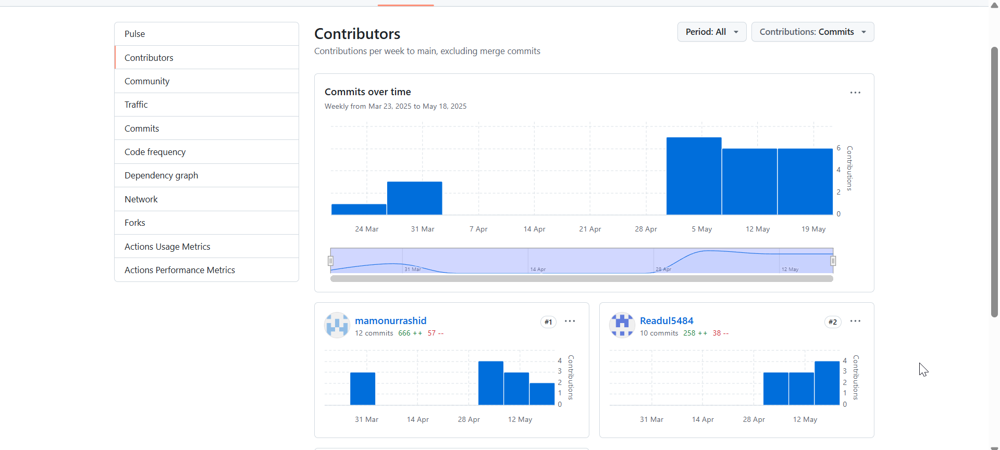

## Task 2

**AP Information**:
1. **AP 1**:
   - **SSID**: he!!o
   - **BSSID**: 58:11:22:14:43:0c
   - **Frequency Band**: 2.4 GHz
   - **Channel**: 6
   - **Data Rate**: 30 Mbps
2. **AP 2**:
   - **SSID**: Virous!
   - **BSSID**: 62:83:e7:22:ea:93
   - **Frequency Band**: 5 GHz
   - **Channel**: 5
   - **Data Rate**: 100 Mbps

## Task 3

**Important Settings and Considerations**:

1. **SSID**: 
   - **Current**: "he!!o"
   - **Consideration**: Change to a unique name like "SmithHome5G" to distinguish from neighbors’ networks and indicate 5 GHz band for clarity, especially in a dense apartment complex.
   - **Reason**: Reduces confusion for devices and users, improving connection reliability.
2. **Channel**: 
   - **Current**: Auto (2.4 GHz, Channel 6; 5 GHz, Channel 36)
   - **Consideration**: For 2.4 GHz, manually set to Channel 1, 6, or 11 based on WiFi Analyzer’s interference data (e.g., Channel 1 if least congested). For 5 GHz, set to a high channel (e.g., 149) to avoid radar interference.
   - **Reason**: Manual channel selection minimizes overlap with nearby APs, boosting performance in crowded areas.

3. **Security Mode**: 
   - **Current**: WPA2-PSK
   - **Consideration**: Upgrade to WPA3 if all devices support it (check compatibility for older devices like IoT gadgets).
   - **Reason**: WPA3 offers stronger encryption and protection against brute-force attacks, critical for securing sensitive data like university assignments.

4. **QoS (Quality of Service)**: 
   - **Current**: Disabled
   - **Consideration**: Enable QoS to prioritize bandwidth for critical applications like Zoom for online classes or Blackboard access, limiting bandwidth for non-essential tasks like streaming.
   - **Reason**: Ensures stable performance for academic tasks in a shared household with multiple users.

5. **Access Control**: 
   - **Current**: Disabled
   - **Consideration**: Enable Access Control to whitelist only known devices (e.g., by MAC address, such as my laptop and phone) and block unauthorized devices.
   - **Reason**: Prevents unauthorized access, critical in a university context where roommates or visitors might attempt to connect, potentially compromising network security.

6. **Parental Controls**: 
   - **Current**: Disabled
   - **Consideration**: Enable Parental Controls to restrict access for specific devices (e.g., a sibling’s tablet) during study hours (e.g., 8 AM–6 PM) or block inappropriate content.
   - **Reason**: Maintains a distraction-free environment for studying, especially during exam periods, by limiting non-academic internet use.

**Screenshot**: The screenshot from the TP-Link Archer AX73 emulator shows the Advanced Wireless Settings page, which displaying SSID ("TP-Link_22DD_2.4GG" & 22DD_5G), Channel mode (Auto), Security (WPA2-PSK), Transmit Power (High), Guest Network (Disabled), Access Control (Disabled under Security tab), and Parental Controls (Disabled under Parental Controls tab).
 

## Task 4: Self-Evaluation of Teamwork

**Generative AI Prompt and Output**:

- **Prompt**: "List 5 ways to improve teamwork in a university group project."

- **Output**:
  1. Set Clear Goals and Expectations Early
  2. Use Collaborative Tools
  3. Assign Roles Based on Strengths
  4. Communicate Regularly and Honestly
  5. Support Each Other and Stay Accountable

**Comparison with Team Practices**:

1. **Establish Clear Communication Channels**:
   - **Practiced**: We use a WhatsApp group for quick updates and questions.
   - **Example**: When I struggled with Clous cost calculation , I messaged the group, and Mamunur shared a relevant tutorial.
2. **Define Roles and Responsibilities Early**:
   - **Practiced**: Roles were assigned in Week 3 (e.g., I will design the HQ Network, Mamunur will design  branc Network).
   - **Example**: I committed the HQ Network diagram, aligning with my role.
3. **Schedule Regular Team Meetings**:
   - **Not Practiced**: We meet irregularly, often only before deadlines.
   - **Improvement**: Schedule weekly 30-minute Zoom meetings to review progress and plan tasks.
4. **Use Collaborative Tools for Task Management**:
   - **Practiced**: We use Google Docs for documentation and GitHub for code.
   - **Example**: Our project report draft is in a shared Google Doc, edited by all members.
5. **Foster a Respectful and Inclusive Environment**:
   - **Practiced**: Team members are supportive and open to ideas.
**GitHub Commit Analysis**:

- **Screenshot Description**: The GitHub Insights > Contributors page shows commits from our team (2 members):
  - Me: 10 commits 
  - Mamunur: 12 commits 

- **My Contribution**: My 10 commits are slightly lower than the team average (11 commits). I contributed to designing the HQ network layout, recommending hardware specifications, calculating Azure cloud costs, and conducting the risk assessment for our project. These tasks involved detailed planning and coordination to ensure our network security solution was robust and cost-effective.

