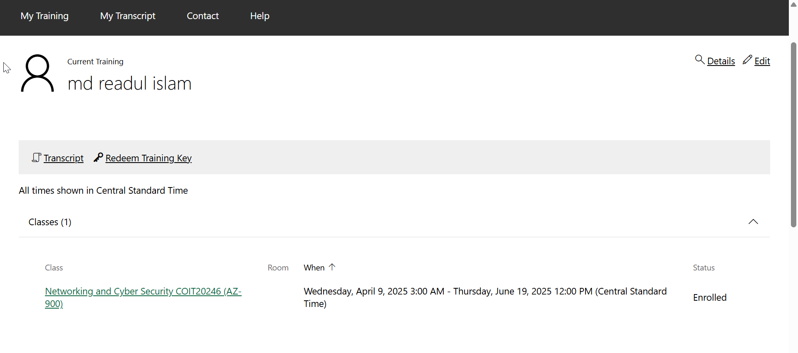
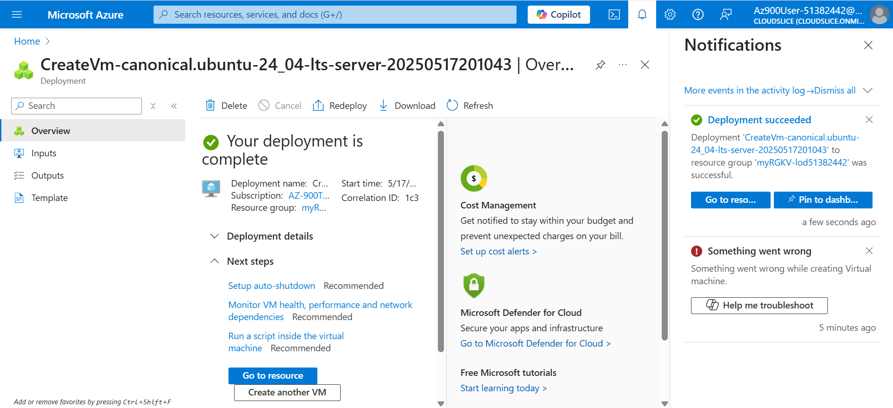
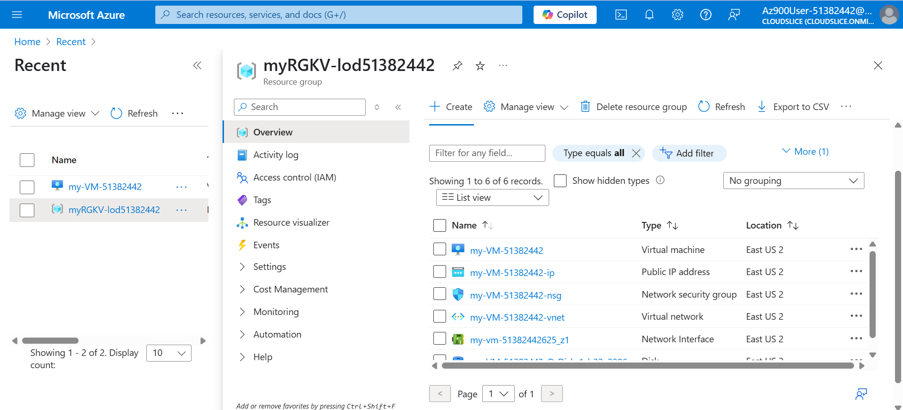

## Task 2: Login to Microsoft Learn on Demand
Visited https://msle.learnondemand.net/, selected "Register with Training Key," and created a Skillable account using my @cqumail.com address. Then logged in with the Skillable account.

## Task 3: Create an Azure Resource
In this task, I createed a virtual machine using the Azure portal by followed the provided instructions.

#### List of Resources:
- **my-VM-51382442 (Virtual Machine)**: This is the main compute resource, an Ubuntu VM, used to run applications and host services like a web server.
- **my-VM-51382442-ip (Public IP Address)**: Assigns a public IP to the VM, enabling external access to the VM, such as for SSH or web access.
- **my-VM-51382442-nsg (Network Security Group)**: Defines security rules to control inbound and outbound traffic to the VM, such as allowing SSH (port 22) and HTTP (port 80).
- **my-VM-51382442-vnet (Virtual Network)**: Provides an isolated network environment for the VM to communicate with other Azure resources securely.
- **my-vm-51382442625_z1 (Network Interface)**: Connects the VM to the virtual network, enabling network communication.
- **my-VM-51382442_OsDisk_1_b32a2286... (Disk)**: The operating system disk for the VM, storing the Ubuntu OS and related system files.

