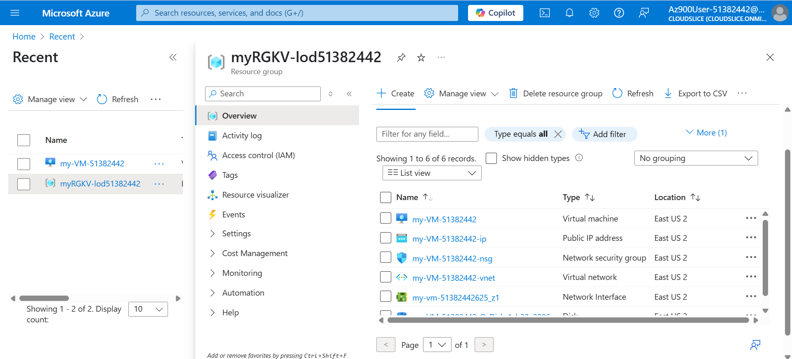
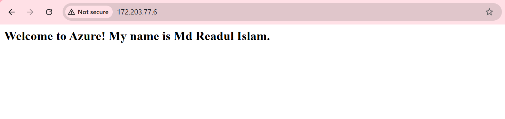
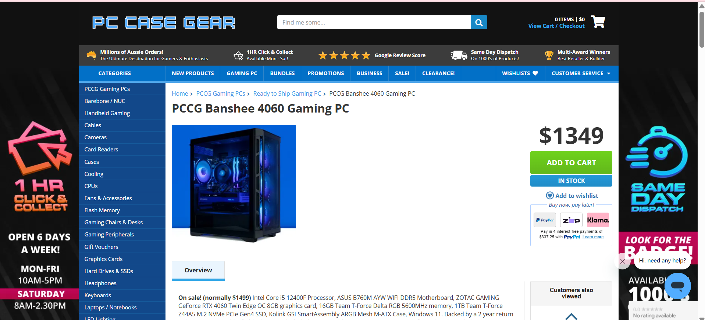
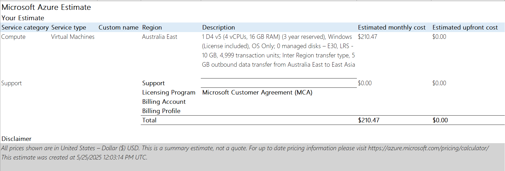
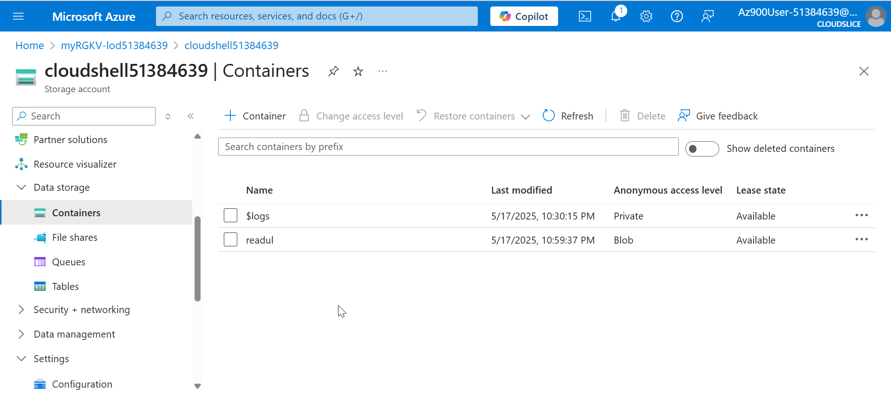

## Task 2:


## Task 3:
In this activity, I used the Azure Portal to set up Azure resources by carefully following the given steps.
#### List of Resources:
- **my-VM-51382442 (Virtual Machine)**: An Ubuntu virtual machine acting as the main computing unit, configured to run applications and services such as a web server.
- **my-VM-51382442-ip (Public IP Address)**: Supplies an external IP address to the VM, supporting connections for tasks like SSH or accessing websites.
- **my-VM-51382442-nsg (Network Security Group)**: Defines traffic rules for the VM, allowing network access through SSH on port 22 and HTTP on port 80.
- **my-VM-51382442-vnet (Virtual Network)**: Sets up a safe network zone for the VM to connect securely with other Azure services.
- **my-vm-51382442625_z1 (Network Interface)**: Connects the VM to the virtual network, supporting network interactions and data transfer.
- **my-VM-51382442_OsDisk_1_b32a2286... (Disk)**: Acts as the storage for the Ubuntu OS and system files, dedicated to the virtual machine’s operations.



## Task 4:
**Azure Commands:** Configured a Linux VM and deployed Nginx with its configuration:
```
# To create a Linux VM
az vm create \
--resource-group myRGKV-lod51383315 \
--name my-VM-51383315 \
--image Ubuntu2204 \
--admin-username azureuser \
--generate-ssh-keys

# To configure Nginx on VM
az vm extension set \
--resource-group myRGKV-lod51383315 \
--vm-name my-VM-51383315 \
--name customScript \
--publisher Microsoft.Azure.Extensions \
--version 2.1 \
--settings '{"fileUris":["https://raw.githubusercontent.com/MicrosoftDocs/mslearn-welcome-to-azure/master/configure-nginx.sh"]}' \
--protected-settings '{"commandToExecute": "./configure-nginx.sh"}'
```
**Public IP Address:** 172.203.77.6

**Successfully accessing website with my name**:


**Network Security Rules:**
- Port 22 (SSH):
  - Rule Name: default-allow-ssh
  - Description: Enables remote management of the VM via SSH protocol.
- Port 80 (HTTP):
  - Rule Name: AllowAnyHTTPInbound
  - Description: Allows web content delivery through HTTP traffic.

## Task 5:
### Specifications and Costs Table

| **Type**           | **CPU**          | **GPU**         | **RAM** | **Storage** | **Upfront Cost (AUD)** | **1-Year Running Cost (AUD)** | **3-Year Running Cost (AUD)** |
|---------------------|------------------|-----------------|---------|-------------|-------------------------|-------------------------------|-------------------------------|
| Consumer Desktop PC | Intel Core i5-12400F | ZOTAC GeForce RTX 4060 8GB | 16GB DDR5 5600MHz | 1TB NVMe SSD | 1,349                   | 150 (electricity)             | 450 (electricity)             |
| Azure VM            | 4 vCPUs (D4 v5)  | N/A (GPU not specified) | 16GB    | 1TB SSD     | 0 (no upfront cost)     | 3,838.92 (monthly $319.91)    | 11,515.52 (monthly $319.91)    |

### Consumer PC Cost  
I found the desktop PC on [PC Case Gear](https://www.pccasegear.com/products/68710/pccg-banshee-4060-gaming-pc).



### Azure Pricing Calculator  
After exporting this price, I convert it to Australian dollars. 
Currency Conversion: 1 USD = 1.52 AUD (xe.com, May 2025).
Azure VM Pricing(3 Yeras): $210.47 USD/month × 12 × 3 = $7,576.92 USD × 1.52 = $11,515.52 AUD.


### Trade-offs Discussion  
Now that the Azure VM meets the requirements, the comparison feels fairer. The desktop PC is still cheaper overall—AUD 1,349 over 1 year and AUD 1,1949 over 3 years, compared to the Azure VM’s AUD 3,838.92 and AUD 11,515.52. That’s a big cost difference, especially over 3 years, since the PC’s main expense is upfront, and electricity isn’t much. The PC also has a great GPU (RTX 4060 8GB), which is perfect for design work, while the Azure VM doesn’t include a GPU, so it’s not as good for those tasks. Both have 16GB RAM and similar CPU power (i5-12400F with 6 cores vs. 4 vCPUs), but the PC’s extra cores give it a slight edge for multitasking. The downside with the PC is that I’d need to handle maintenance—like fixing hardware or upgrading parts—which could add costs, and I’d have to manage security updates myself.

The Azure VM is more expensive, but it has some advantages. There’s no upfront cost, which is nice if I don’t have AUD 1,349 to spend right away. I can scale it up easily—like adding more CPU or storage—while upgrading the PC means buying new hardware. Azure takes care of maintenance, backups, and security updates, which saves me time, and I can access it from anywhere, unlike the PC, which stays at home. But the monthly cost adds up fast, and if I forget to turn it off, I’ll end up paying more. Also, slow internet could make it tricky to use, and without a GPU, it’s not great for graphics-heavy tasks.

For me, the desktop PC is the better choice because it’s way cheaper and has a GPU, which I’d use for gaming. The Azure VM makes sense if I need flexibility and don’t want to deal with hardware maintenance, but the cost difference makes the PC more practical for my needs.
## Task 6:
**Screenshot of Image:** Presents a single image uploaded to the storage container.


**Screenshot of Azure Portal:** Illustrates the storage container created within the Azure Portal.


## Task 7:
**Difference Between Locks:**
- **Read-Only Lock:** Restricts alterations to a resource’s properties or settings (e.g., modifying VM configurations), ensuring its current state is preserved. This is useful for preventing unintended changes to critical setups.
- **Delete Lock:** Blocks the deletion of a resource, keeping it active in the Azure environment while allowing modifications to its settings. This is ideal for protecting essential resources from accidental removal.
