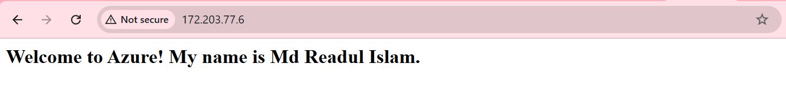

## Task 2: Login to Microsoft Learn on Demand
Visited https://msle.learnondemand.net/, selected "Register with Training Key," and created a Skillable account using my @cqumail.com address. Then logged in with the Skillable account.


## Task 3: Create an Azure Resource
In this task, I created Azure Resources using the Azure portal by followed the provided instructions.

#### List of Resources:
- **my-VM-51382442 (Virtual Machine)**: This is the main compute resource, an Ubuntu VM, used to run applications and host services like a web server.
- **my-VM-51382442-ip (Public IP Address)**: Assigns a public IP to the VM, enabling external access to the VM, such as for SSH or web access.
- **my-VM-51382442-nsg (Network Security Group)**: Defines security rules to control inbound and outbound traffic to the VM, such as allowing SSH (port 22) and HTTP (port 80).
- **my-VM-51382442-vnet (Virtual Network)**: Provides an isolated network environment for the VM to communicate with other Azure resources securely.
- **my-vm-51382442625_z1 (Network Interface)**: Connects the VM to the virtual network, enabling network communication.
- **my-VM-51382442_OsDisk_1_b32a2286... (Disk)**: The operating system disk for the VM, storing the Ubuntu OS and related system files.


## Task 4: Create an Azure Virtual Machine and Allow Web Access
**Azure Commands:** To create a Linux VM and configure Nginx on the VM.
```
# To create a Linux VM
az vm create \
--resource-group myRGKV-lod51383315 \
--name my-VM-51383315 \
--image Ubuntu2204 \
--admin-username azureuser \
--generate-ssh-keys

# To configure Nginx on VM
az vm extension set \
--resource-group myRGKV-lod51383315 \
--vm-name my-VM-51383315 \
--name customScript \
--publisher Microsoft.Azure.Extensions \
--version 2.1 \
--settings '{"fileUris":["https://raw.githubusercontent.com/MicrosoftDocs/mslearn-welcome-to-azure/master/configure-nginx.sh"]}' \
--protected-settings '{"commandToExecute": "./configure-nginx.sh"}'
```
**Public IP Address:** 172.203.77.6
**Successfully accessing website with my name**


**Network Security Rules:**
- Port 22 (SSH):
-- Rule Name: default-allow-ssh
  Description: Allows Secure Shell (SSH) access to the VM for remote administration.
- Port 80 (HTTP):
-- Rule Name: AllowAnyHTTPInbound
  Description: Allows Hypertext Transfer Protocol (HTTP) access to serve web content.
