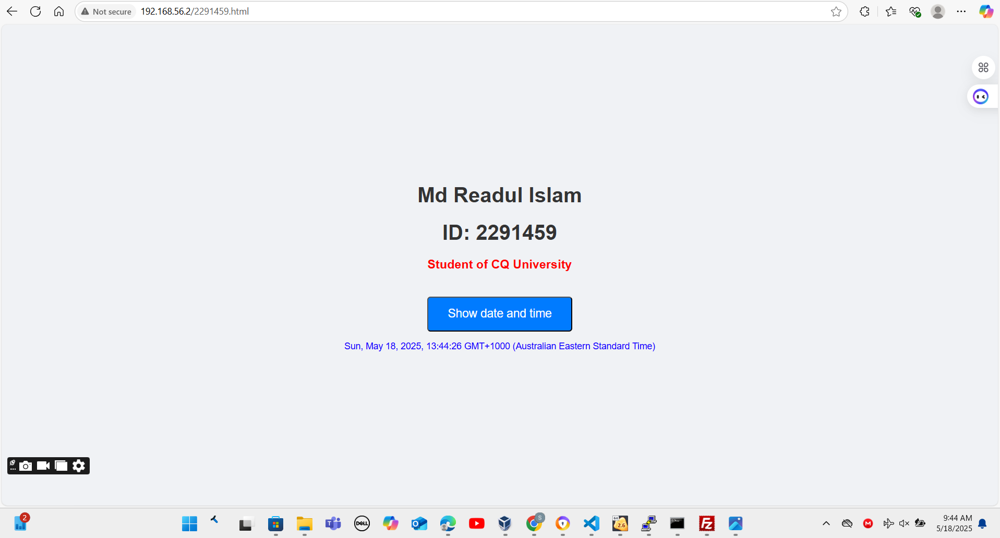
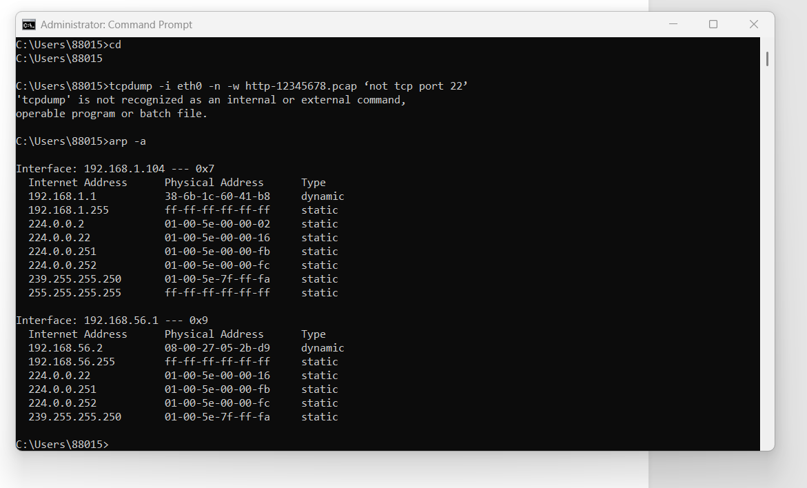
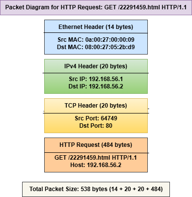
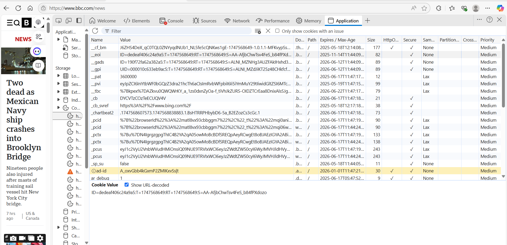

## Task 2
**Create or Modify the Following Files:**
- [index.html](images/index.html)
- [12301422.html](images/12301422.html)
- [styles.css](images/mystyle.css)

The webpage is accessible through any web browser using `http://192.168.56.2`. Initially, it displays the index page. When the "Show date and time" button is clicked, the current date and time are displayed on the screen

## Task 3

**HTTP Traffic Capture File**: [http-12301422.pcap](images/http-12301422.pcap)

**ARP Table**:

## Task 4

#### a) Understanding HTTP Request/Response Cycles: Triggers, Requests, and Responses Explained
- **No. 4: 192.168.56.1 → 192.168.56.2 (HTTP/1.1 & GET, 495 bytes)**
  - Trigger: I opened the browser and navigated to the webserver root (entered server IP or domain name).
  - Request: The request for the web page was an HTTP GET to the root (/).
  - Response: No response is shown in this capture (likely followed in a later packet).
- **No. 8: 192.168.56.2 → 192.168.56.1 (HTTP/1.1 200 OK, 692 bytes)**
  - Response to the GET request (No. 4).
  - The browser requested the root page (/).
  - The server responded with 200 OK, delivering the root page (text/html content).
- **No. 9: 192.168.56.1 → 192.168.56.2 (GET /mystyle.css HTTP/1.1, 390 bytes)**
  - Trigger: Browser parsed HTML from the root page, which likely referenced a CSS file.
  - Request: Browser requested /mystyle.css with HTTP GET.
  - Response: No response is shown (likely in a later packet).
- **No. 13: 192.168.56.2 → 192.168.56.1 (HTTP/1.1 200 OK, 225 bytes)**
  - Response to the GET request for /mystyle.css (No. 9).
  - The browser requested the mystyle.css file.
  - The server responded with 200 OK status, serving the CSS file (text/css).
- **No. 15: 192.168.56.1 → 192.168.56.2 (GET /12301422.html HTTP/1.1, 539 bytes)**
  - Trigger: The user followed a link on the root page, navigating to 12301422.html.
  - Request: The browser requested /12301422.html.
  - Response: No response is shown (likely in a later packet).
- **No. 19: 192.168.56.2 → 192.168.56.1 (HTTP/1.1 200 OK, 644 bytes)**
  - Response to the GET request for /12301422.html (No. 15).
  - The browser requested the page 12301422.html.
  - The server responded with 200 OK status, delivering the HTML page.
- **No. 20: 192.168.56.1 → 192.168.56.2 (GET /mystyle.css HTTP/1.1, 488 bytes)**
  - Trigger: Browser parsed 12301422.html, which likely referenced the same CSS file (mystyle.css).
  - Request: The browser requested /mystyle.css in an HTTP GET.
  - Response: No response is shown (likely in a later packet).
- **No. 23: 192.168.56.2 → 192.168.56.1 (HTTP/1.1 304 Not Modified, 189 bytes)**
  - Response to the GET request for /mystyle.css (No. 20).
  - The browser requested the CSS file (mystyle.css).
  - The server returned 304 Not Modified status, allowing the browser to use the cached file.

#### b) First HTTP Request/Response: Identifying the Following
**First HTTP request (No. 4: GET / HTTP/1.1):**
1. Source IP Address: 192.168.56.1
2. Destination IP Address: 192.168.56.2
3. Source Port: 62219
4. Destination Port: 80
5. Transport Protocol: TCP (HTTP runs over TCP, implied by the packet capture context).

#### c) Browser Behavior on Date/Time Button Click: Did a Web Server Request Occur?
No, the browser did not perform a request to the server to display the date and time when the user clicked the button.  
**Reason:** The date/time is typically computed client-side using JavaScript (e.g., `Date()` object). Since the browser can access the system time locally, no server request is needed. The packet capture does not show any requests aligning with this action (e.g., a GET request for a time-related resource).

#### d) Packet Diagram for HTTP Request/Response of Newly Created Web Page (12301422.html)
**HTTP request for 12301422.html is packet No. 15 (Time: 9.659994, GET /12301422.html HTTP/1.1, Length: 539 bytes).**

**Origine of Diagram file**: [packet_diagram.drawio](images/week6-task4-packet_diagram.drawio)

**Breakdown of Sizes:**
- Ethernet Header: 14 bytes
- IPv4 Header: 20 bytes
- TCP Header: 20 bytes
- HTTP Request: 485 bytes (total packet length is 539 bytes; subtract 14 + 20 + 20 = 66 bytes for headers).
- **Total Packet Size:** 539 bytes.

**Addresses:**
- Ethernet Header: 0a:00:27:00:00:0a (Source MAC), 08:00:27:05:2b:d9 (Destination MAC)
- IPv4 Header: 192.168.56.1 (Source IP), 192.168.56.2 (Destination IP)
- TCP Header: Source Port (62219), Destination Port (80).
- HTTP Request: Host header likely contains 192.168.56.2 (the server’s IP).

#### e) Analyzing the HTTP Referrer for the Request in Part (d): Referrer Value, Identification, and Web Server Usage
**Referrer Value:**
For packet No. 15 (GET /12301422.html), the referrer is the page that linked to 12301422.html. As the user clicked a link on the homepage (/), the referrer is: `http://192.168.56.2/`.

**What Does It Identify?**
The referrer indicates the URL of the page from which the request originated, showing that the user was on the homepage before requesting 12301422.html.

**How Web Servers Use This Information:**
1. **User Navigation Tracking:** Servers log the referrer to track how users navigate the site (e.g., which pages lead to others).
2. **Analytics and Marketing:** It identifies traffic sources (e.g., external sites linking to the page).
3. **Security:** Servers use the referrer to detect unauthorized linking (hotlinking) or malicious activity by checking for unexpected referrers.
4. **Content Customization:** Servers may serve different content based on the referring page (e.g., related links or ads).

#### f) HTTP Request from Part (d): Browser Information (Name, Version) Revealed to the Server
For packet No. 15 (GET /12301422.html), the HTTP request likely includes a User-Agent header, providing browser details.

**Information the Server Learned:**
- Name: Chrome
- Version: 137.0.7151.40
- OS: Windows 11 (from Windows NT 11.0)
- Architecture: 64-bit (from Win64; x64)
- Rendering Engine: WebKit (from AppleWebKit/537.36)

The server can use this to optimize content delivery (e.g., serving browser-specific features) or for analytics (e.g., tracking browser usage statistics).

#### g) Use of HTTP Version and Transport Protocol
- **HTTP Version:** HTTP/1.1 (as seen in packets 9, 13, and 19 with "HTTP/1.1").
- **Transport Protocol:** TCP (indicated by TCP in all packets).

#### h) TCP Connection Setup: Packet Analysis and Timing
**Packets Involved in Connection Setup:**
- Packet 1: SYN (Seq=0 Win=65535 Len=0).
- Packet 2: SYN-ACK (Seq=0 Ack=1 Win=64280 Len=0).
- Packet 3: ACK (Seq=1 Ack=1 Win=65280 Len=0).

**Time Between Start of Connection Setup and Data Transfer:**
- Start: Packet 1 at 0.000047 s.
- Data Transfer: Packet 5 (HTTP GET) at 0.008091 s.
- Time: ~0.008044 s (8.044 ms).

#### i) Recognize the Acknowledgements: When Are They Typically Sent?
**Acknowledgments:**
- Packet 3: ACK (Seq=1 Ack=1 Win=65280 Len=0).
- Packet 6: ACK (Seq=1 Ack=442 Win=64880 Len=4).
- Packet 8: ACK (Seq=442 Ack=1 Win=65280 Len=0).
- Packet 10: ACK (Seq=778 Ack=1 Win=64880 Len=41).
- Packet 12: ACK (Seq=778 Ack=181 Win=65280 Len=0).
- Packet 14: ACK (Seq=2352 Ack=1 Win=65280 Len=0).
- Packet 18: ACK (Seq=1263 Ack=3853 Win=65280 Len=0).
- Packet 24: ACK (Seq=1697 Ack=4629 Win=64512 Len=0).

**When Typically Sent:** Acknowledgments are sent as soon as a TCP segment (e.g., SYN-ACK or data) is received, but they may be delayed by TCP's delayed ACK mechanism (e.g., ~200 ms or after two segments).

## Task 5

# COIT20246 Networking and Cyber Security - Week 06 Tutorial Activities
## Task 5: View Your Cookies [20 min, Homework]

**Explanation of Type of Information Found in Cookies:** From a web browser, cookies are used to store various types of information, including session management, tracking, authentication, and user preferences. The types of information stored include:

1. **Session Identifiers:** Cookies such as `Secure-1PSID`, `Secure-3PSID`, or `cfuvid` store session IDs to track users across multiple pages or future visits to the website.
2. **Authentication Tokens:** Cookies like `Secure-1PSIDCC`, `Secure-3PSIDCC`, and `_Secure-ENID` store authentication tokens or secure login-related information to authenticate users and prevent unauthorized access to accounts or services.
3. **Tracking & Analytics:** Cookies such as `_ga`, `_ga_1VC9IXRYWRC`, and `_fbp` are used for tracking visitor behavior. These are typically set by Google Analytics (`_ga`) or Facebook (`_fbp`) to monitor page views, user interactions, and campaign effectiveness.
4. **User Preferences and Settings:** Cookies like `dds` and `_rb` may store user preferences, such as display settings or user actions, to customize the website experience (e.g., ambient display options or user-specific settings).
5. **Advertising Identifiers:** Cookies such as `_eoi` and `_rb` (e.g., `ID=497e8c833905...` for `_eoi`) are used for ad targeting, storing user identification information to deliver personalized advertisements.
6. **Security and Anti-Fraud:** Cookies like `Secure-1PSIDTS` and `Secure-3PSIDTS` (e.g., `sidts=CjIBl...` for `Secure-1PSIDTS`) are used for security purposes, such as session timestamping to prevent replay attacks or ensure secure communication.
7. **Content Delivery and Performance:** Cookies like `cf_bm` and `cfuvid` (e.g., `NuN45Hdr6RVHC...` for `cf_bm`) are used by Cloudflare for bot management, load balancing, and content delivery optimization.
8. **Cross-Site Behavior:** The `SameSite` flag (e.g., "None" or "Lax") determines how cookies interact with cross-site requests. "None" allows cookies in cross-site contexts (e.g., third-party embeds), while "Lax" and "Strict" restrict this for security.
9. **Expiration and Persistence:** The `Expires` column indicates cookie duration. Session cookies (e.g., `cfuvid`) expire when the browser closes, while others persist for months or years.
10. **Priority and Size:** The `Priority` column ("Medium," "High") indicates the cookie's importance for website functionality, with "High" often tied to essential authentication cookies. The `Size` column (e.g., 177, 82) shows the cookie's data size in bytes.

**Summary:** These cookies manage session tracking, authentication, user behavior tracking, personalization, security, and performance optimization, primarily for services like Google, Cloudflare, and advertising platforms.
